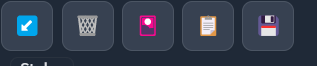
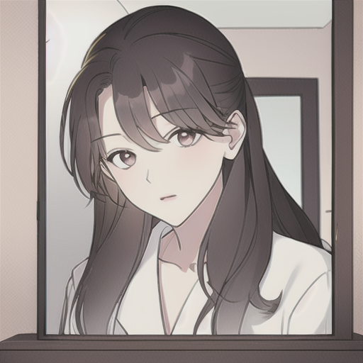
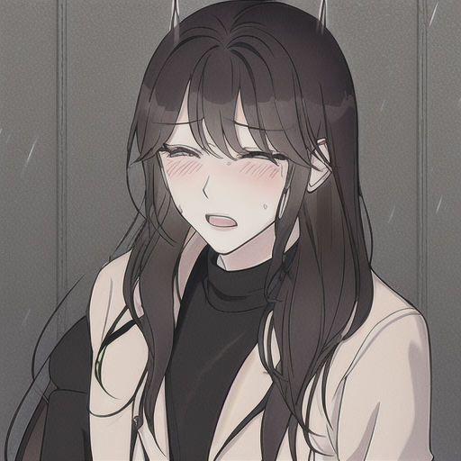
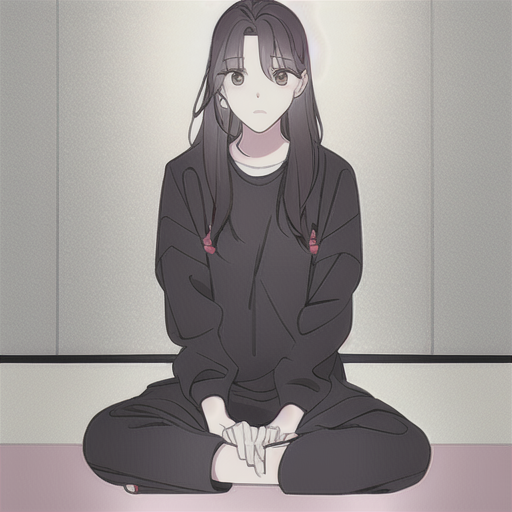
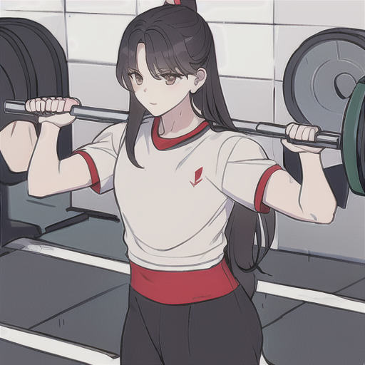
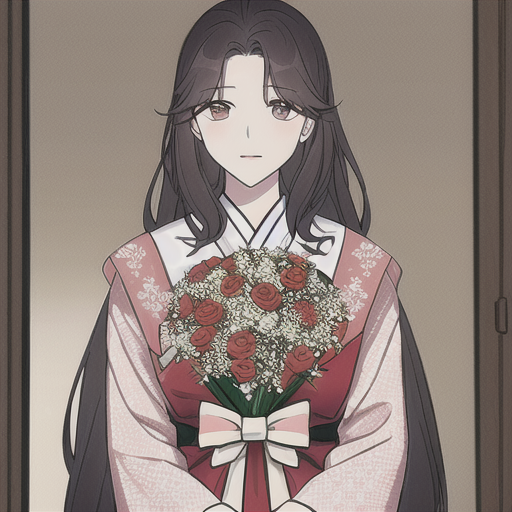
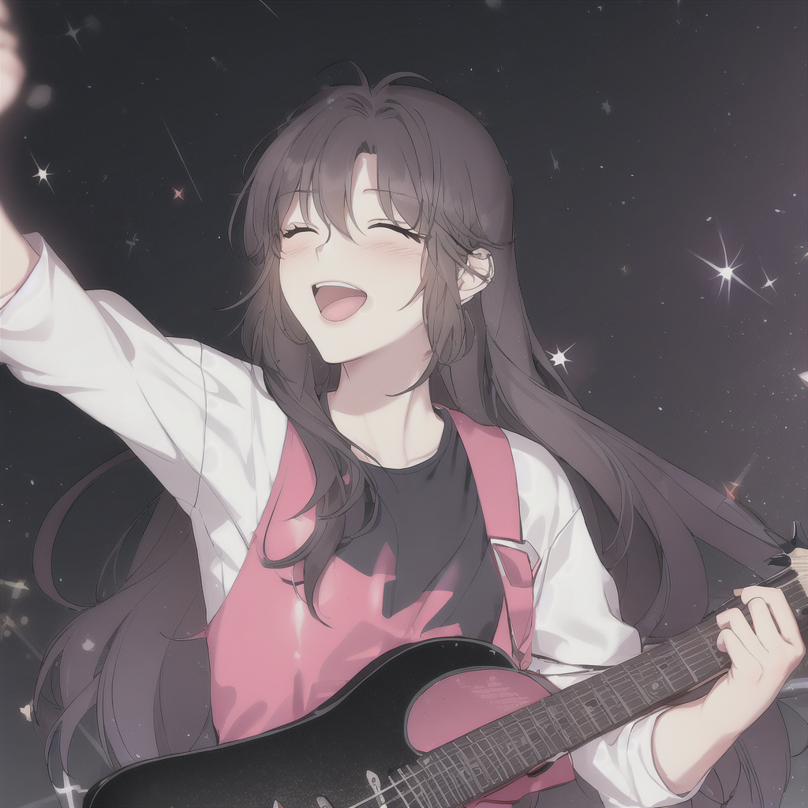
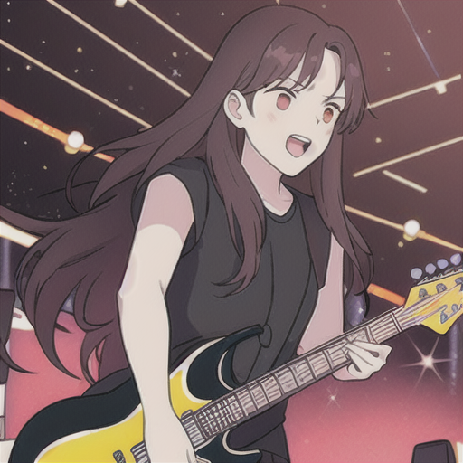

# Jeon LoRA Dreambooth

The goal here is to train a model/embedding or lora adaption to generate the required character in varying poses and scenes. First of all rather than using the generic term 'svs' we will use jeon as the character name. This is because svs is already present in stable-diffusion and will cause confusion.


## Workflow:

We will train a LoRA embedding using a dreambooth method. Following is the high level workflow:

1. Check images for obvious quality issues. If there are any remove them. (A few duplicate images were removed)
2. Then we will use BLIP to generate captions.
3. Check the captions for obvious error and remove them. (A few captions were corrected/edited)
4. We will use low-vram version of training. The training takes only 5~10 minutes.

## Main goals:

1. The process shoould be scaleable. Training should take minimum possible time with less than 10 GB Vram required.
2. We should be able to learn the character once and apply multiple styles.

 
## Training Process:

To begin the training we need to select a stable_diffusion checkpoint. For this experiment as we are dealing with a comic with an anime like style. We will use the following checkpoint:

```bash 
https://huggingface.co/andite/anything-v4.0/blob/main/anything-v4.5-pruned.safetensors
```
We then use the diffusers package to setup the training pipeline. Here are the main training parameter:

```python
# Training parameters
batch_size = 1
learning_rate = 0.0001
epochs = 1
steps_per_image = 70
LR_scheduler = 'constant'
text_encoder_lr = 5e-4
max_resolution = 1024
gradient_accumulate_every = 1
adam = "8bit"
xformers = True
```
## WebUI setup:

To setup the GUI pipeline we first need to setup the webUI. To quickly setup the webui we will use docker:

```bash
git clone https://github.com/AbdBarho/stable-diffusion-webui-docker.git
cd stable-diffusion-webui-docker
docker compose --profile download up --build
docker compose --profile auto up --build
```
The above will setup and run the webUI.

We then  need to install the following extension in the webUI:
    
```bash 
Name: sd-webui-additional-networks
https://github.com/kohya-ss/sd-webui-additional-networks.git
```

This would add a purple window looking buttion to display additional networks. Such as Lora:


After doing this we need to download the relevant checkpoints and LoRA embeddings. For this assuming that webUI is setup correctly. We need to download and copy the following model to the correct directory:

Assuming you are in the webui repo directory:
```bash
cd data/StableDiffusion
wget https://huggingface.co/andite/anything-v4.0/resolve/main/anything-v4.5-pruned.safetensors
```
This will download the anything-v4.5-pruned.safetensors checkpoint.

Then we need to download the jeon_lora.safetensors embedding:

```bash
cd data/Lora
wget https://huggingface.co/sabbih/jeon/resolve/main/jeon.safetensors
```

### Results

We start with some of the easier prompts:

```
jeon with long hair looking at the mirror, <lora:jeon:0.85>
```


```
jeon with long hair crying in the rain, <lora:jeon:0.85>
```


```
Now for some medium difficulty prompts:

```bash
jeon with long hair sitting cross legged on the floor, <lora:jeon:0.85>
```



Now for a difficult prompt:

```
jeon with long hair, lifting dumbbells in the gym, full view, <lora:jeon:0.80>
```



Now we try prompts that are a bit descriptive:

```
jeon with long hair posing for a portrait, wearing a stunning traditional dress and holding a bouquet of flowers, <lora:jeon:0.80>
```



```
jeon with long hair performing an epic guitar solo on stage, bathed in the glow of flashing lights and cheering crowds. <lora:jeon:0.80>
```


Now finally we can easily adapt this character LoRA to many other art styles for example the same prompt as above we can add Studio Ghibli style:




## Note:

1. LoRA dreambooth is a very scalable approach as compared to full size checkpoints. The jeon.safetensors embedding is only 19 MB in size.
2. Multiple LoRAs can be combined. For example you could have multiple style LoRA embeddings for comics, manga and manhua etc. And, apply them on the same character LoRA embedding.
3. Using a LoRA does not require to reload the complete model. You just need to load the relevant LoRA embedding only.
4. This also means that the model does not overfit as we don't change the model weights. 